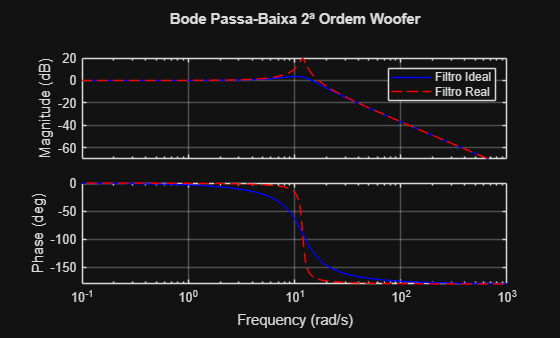
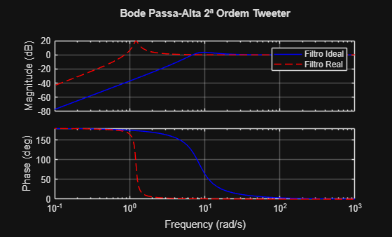

# Projeto de Filtos Passivos
# Nome: Pedro Henrique Gnoatto Rosa RA:2342901

# Problema
Você foi contratado(a) como engenheiro(a) para projetar um crossover passivo para uma caixa de som de duas vias (woofer e tweeter). O objetivo é garantir que os sinais de baixa frequência sejam enviados apenas para o woofer e os de alta frequência apenas para o tweeter, com máxima fidelidade e uma transição suave.

# Objetivos
-  Calcular valores ideias e selecionar os valores reais dos resistores e capacitores, apartir da frequência de corte e impedância da carga; 
-  Gerar as funções de transferência dos filtros Passa\-Baixa e Passa\-Alta ideias e reais; 
-  Gerar gráficos de Bode para comparar os filtros ideias e reais; 
-  Documentar o projeto. 

# Fundamentação Teórica
O projeto envolve o desenvolvimento de filtros de 2ª ordem **Butterworth**, escolhido devido possuir resposta plana na banda passante e uma transição suave no **woofer** e **tweeter**. As funções que descrevem o comportamento dos filtros são:

## 
1. Butterworth de 2ª ordem

um filto Butterworth tem resposta plana na banda de passagem e sua frequência de corte é descrito por:

 $$ \omega_c =2\pi f_c $$ 

A função de transferência de um filto de Butterworth de 2ª ordem é descrito pela equação:

 $$ H\left(S\right)=\frac{1}{s^2 +\sqrt{2}\omega_c \;s+{\omega_c }^2 } $$ 

## 
2. Filto Passa\-Baixa (Woofer)

Usando um indutor em série e capacitor em derivação com a carga, a função de transferência é descrito pela equação:

 $$ H_{\textrm{LP}} \left(S\right)=\frac{1}{\textrm{LC}{\;s}^2 +R_L C\;s+1} $$ 

Onde:
 $L=\frac{R_L }{\pi f_c }$ (Henry) Indutor 


 $C=\frac{1}{2\pi f_c R_L }$ (Farad) Capacitor

 $$ f_c =\textrm{frequência}\;\textrm{de}\;\textrm{corte} $$ 

 $$ R_L =\textrm{impedância}\;\textrm{de}\;\textrm{carga} $$ 

## 
3. Filtro Pass\-Alta (Tweeter)

Usando um capacitor em série e indutor em derivação com a carga, a função de transferência é descrito pela equação:

 $$ H_{\textrm{HP}} \left(S\right)=\frac{Z_{||} }{Z_{||} +Z_C } $$ 

Onde:
 $Z_C =\frac{1}{s\;C}$ indutância do capacitor


 $Z_L =s\;L$ indutância do indutor


 $Z_{||} =\frac{Z_L \;R_L }{Z_L +R_L }$ Indutância paralela


 $C=\frac{1}{\pi f_c R_L }$ (Farad) Capacitor


 $L=\frac{R_L }{2\pi f_c }$ (Henry) Indutor

# Algoritmo do Programa
Feito para projetar um crossover passivo para uma caixa de som de duas vias utilizando de filtros Butterworth de 2ª ordem. O Algoritmo segue a sequência

## 
1. Entrada de dados do projeto

As especificações da frequência de corte e de impedância de carga, junto com uma lista de indutores e capacitores comerciais já são inseridas para fazer as demais etapas

```matlab
fc=1.9; %freqCorte kHz
Rl=8;   %impCarga

%Mili Henry
indutores = [0.10, 0.12, 0.15, 0.18, 0.22, 0.27, 0.33, 0.39, 0.47, 0.56, 0.68, 0.82, 1.0, 1.2, 1.5, 1.8, 2.2, 2.7, 3.3, 3.9, 4.7, 5.6, 6.8, 8.2, 10, 12, 15];

%Micro Faraday
capacitores = [1.0, 1.2, 1.5, 1.8, 2.2, 2.7, 3.3, 3.9, 4.7, 5.6, 6.8, 8.2, 10, 12, 15, 18, 22, 27, 33, 39, 47, 56, 68, 82, 100];
```
## 
2. Cálculo dos compomentes Ideais e Reais

O cálculo dos componentes ideais é feito atráves das equações e funções descritas, já para os componentes reais foi criado uma biblioteca com a função de calcular a o componente com menor erro para selecionar o melhor componente.

 $$ \textrm{erro}=|X_{\textrm{ideal}} -X_{\textrm{real}} | $$ 
```matlab
fprintf("\nButterworth Passa-Baixa\n");
```

```matlabTextOutput
Butterworth Passa-Baixa
```

```matlab

Li = Rl/(pi*fc); %Indutor Ideal;
fprintf("Indutor ideal %.2f mH\n",Li);
```

```matlabTextOutput
Indutor ideal 1.34 mH
```

```matlab
Lr = Componente(Li,indutores,'L'); %Indutor Real
```

```matlabTextOutput
Indutor real: 1.20 mH
```

```matlab

Ci = 1/(2*pi*fc*Rl); %Capacitor Ideal
fprintf("Capacitor ideal %.2f µF\n",Ci);
```

```matlabTextOutput
Capacitor ideal 0.01 µF
```

```matlab
Cr = Componente(Ci,capacitores,'C'); 
```

```matlabTextOutput
Capacitor real: 1.00 µF
```

```matlab

fprintf("\nButterworth Passa-Alta\n");
```

```matlabTextOutput
Butterworth Passa-Alta
```

```matlab
Li = Rl/(2*pi*fc); %Indutor Ideal;
fprintf("Indutor ideal %.2f mH\n",Li);
```

```matlabTextOutput
Indutor ideal 0.67 mH
```

```matlab
Lr = Componente(Li,indutores,'L'); %Indutor Real
```

```matlabTextOutput
Indutor real: 0.68 mH
```

```matlab

Ci = 1/(pi*fc*Rl); %Capacitor Ideal
fprintf("Capacitor ideal %.2f µF\n",Ci);
```

```matlabTextOutput
Capacitor ideal 0.02 µF
```

```matlab
Cr = Componente(Ci,capacitores,'C'); %Capacitor Real
```

```matlabTextOutput
Capacitor real: 1.00 µF
```

```matlab

function CompReal = Componente(ideal,valor,tipo)
    
    [~,pos] = min(abs(valor-ideal));
    CompReal = valor(pos);

    if strcmp(tipo,'L')
        fprintf("Indutor real: %.2f mH\n", CompReal)
    elseif strcmp(tipo,'C')
        fprintf("Capacitor real: %.2f µF\n", CompReal)
    end
end
```
## 
3. Projeto das funções de transferência

O algoritmo projeta as funções de transferência para os componentes ideias e dos reais. O ideal usa os valores encontrado pelas equações já o real utiliza dos valores dados pela função que encontra o melhor componente.

```matlab
fprintf("\nButterworth Passa-Baixa\n");
```

```matlabTextOutput
Butterworth Passa-Baixa
```

```matlab
%%Passa-Baixa 2ª Ordem Ideal
C = Ci;
L = Li;
Q = Rl *sqrt(C/L);  %Fator de Qualidade
num = wc^2;
den = [1, wc/Q, num];
LP2I= tf(num,den); %Lowpass Ideal

%%Passa-Baixa 2ª Ordem Real
C = Cr;
L = Lr;
Q = Rl *sqrt(C/L);  %Fator de Qualidade
num = wc^2;
den = [1, wc/Q, num];
LP2R = tf(num,den); %Lowpass Real

fprintf("\nButterworth Passa-Alta\n");
```

```matlabTextOutput
Butterworth Passa-Alta
```

```matlab
%%Passa-Alta 2ª Ordem Ideal
C = Ci;
L = Li;
Zc = 1/(s*C);           %Impedancia Capacitor
Zl = s*L;               %Impedancia Indutor
Z1 = (Zl*Rl)/(Zl+Rl);   %Impedancia Paralela 
HP2I = Z1/(Zc+Z1);      %Highpass Ideal

%%Passa-Alta 2ª Ordem Real
C = Cr;
L = Lr;
Zc = 1/(s*C);           %Impedancia Capacitor
Zl = s*L;               %Impedancia Indutor
Z1 = (Zl*Rl)/(Zl+Rl);   %Impedancia Paralela 
HP2R = Z1/(Zc+Z1);      %Highpass Real

```
## 
4. Geração dos gráficos de Bode

Utilizando das funções de transferência tanto ideiais quanto reais é o algoritmo executa:
-  Cálculo da magnitude e fase nas funções de transferência; 
-  Gráfica ambas respostas no mesmo gráfico, permitindo comparação de: 
  - Deslocamento da frequência de corte; 
  - Diferença de inclinação; 
  - Diferença entre componentes reais e ideias. 

# Guia de Execução
-  Instalação dos arquivos Projeto.m e da biblioteca Componente.m e abrir ambos no Matlab; 
-  Executar o programa; 
-  Ao executar será mostrado no terminal os valores dos componentes ideais  e reais para cada filto; 
-  Será mostrado duas janelas gráficas, uma para o bode do Woofer e do Tweeter, fazendo a comparação dos componentes; 

# Resultados
Para a análise de resultados os dados utilizados foram de 1.9 kHz para frequência de corte, e de 8 $\Omega$ para impedância de carga. Para o cálculo dos componentes o algoritmo retorna:

Butterworth Passa\-Baixa
- Indutor ideal 1.34 mH
- Indutor real: 1.20 mH
- Capacitor ideal 0.01 µF
- Capacitor real: 1.00 µF

Butterworth Passa\-Alta
- Indutor ideal 0.67 mH
- Indutor real: 0.68 mH
- Capacitor ideal 0.02 µF
- Capacitor real: 1.00 µF

Pode\-se notar que há uma proximidade entre os componentes indutores, já com os capacitores os há uma discrepância entre os valores ideias e de componentes reais, sendo assim o componente que mais afeta os filtros.

Usando esses valores de componentes o diagrama de Bode comparativo dos filtros é:

## Filto Woofer:
```matlab
figure;
bode(LP2I, 'b', LP2R, 'r--');
legend('Filtro Ideal','Filtro Real');
grid on;
title('Bode Passa-Baixa 2ª Ordem Woofer');
```



## Filtro Tweeter:
```matlab
figure;
bode(HP2I, 'b', HP2R, 'r--');
legend('Filtro Ideal','Filtro Real');
grid on;
title('Bode Passa-Alta 2ª Ordem Tweeter');
```



Os filtros Butterworth com componentes ideias seguem o modelo teórico, mantendo a banda passante plana e transição suave, em contrapartida os filtos com componentes reais é visto alterações, nos filtros woolfer e tweeter há elevações antes da transição o que permite que algumas frequências indesejadas entrem.

# Análise dos Resultados
O principal fator da análise é a diferença entre os componentes ideais e reais e seus efeitos

## 
1. Diferença de Valores

Os valores calculados para L e C ideais são diferentes dos valores de componentes comerciais reais, em relação aos indutores as diferenças foram sutis no paixa baixa sendo de aproximadamente 10,5% e no passa alta de 1,5%, a grande diferença se percebe nos capacitores indo 98% a 99% de erro, sendo o que mais afetava fatores como amortecimento e frequência do filtro.

## 
2. Deslocamento da Frequência de corte

Ao utilizar os valores comerciais reais, percebe\-se um deslocamento na frequência de corte,sendo visível nos gráficos de Bode, sendo mais perceptível no filtro de Tweeter onde ocorre um grande adiantamente em relação o filtro com componentes ideais.

## 
3. Efeitos teóricos e práticos

Os principais efeitos que essa diferença podem causar são:
-  Transições menos suaves nos filtros utilizados; 
-  Sobreposições ou cancelamentos de frequências no crossover; 
-  Alteração suave nos tons; 
-  Passagem de frequências indesejadas e cancelamento de frequências desejadas perto da frequência de corte;
  
Em sistemas de áudio mais simples essas diferenças acabam sendo mais sutis e de pouco impacto, já em sistemas maiores, essas diferenças acabam sendo mais perceptíveis precisando gerar ajustes maiores e componentes de alta precisão.

## 
4. Percepção dos Efeitos

A diferença é pouco audível, principalmente pois:
-  O ouvido humano tem tolerância a algumas alterações de amplitude; 
-  O alto\-falante acaba mascarando parte das imperfeições; 
-  O ruído do ambiente pode afetar mais as frequência do que os filtro;
  
Mesmo assim, em ambientes controlados, pode se notar esses deslocamentos e pequenos ruídos principalmente na transição de graves e agudos;

# Conclusão
A proposta do projeto foi comprida, desenvolver um algoritmo que calcula os valores de componentes ideias e seleciona dentro de uma lista o componente comercial real mais próximo para poder realizar um filtro Butterworth de 2ª ordem e apresentar o diagrama de Bode mostrando a diferença entre os componentes. Com essa comparações pode\-se fazer uma análise dessa diferença e seus efeitos práticos.

O maior desafio do projeto é a limitação da lista de componentes reais, o que pode afetar mais ou menos projetos dependendo das frequências de corte e impadância da carga, o que reforça a análise desses componentes para ver seus reias impactos antes de fazer projetos práticos.

O projeto demonstra dessa forma que mesmo que surjam pequenas váriações e ainda possam ser usados para aplicações mais simples ainda deve ser levado em conta a simulação, análise para projetos maiores com diversos componentes para que essas diferenças sejam menos perceptíveis ainda.

## 
